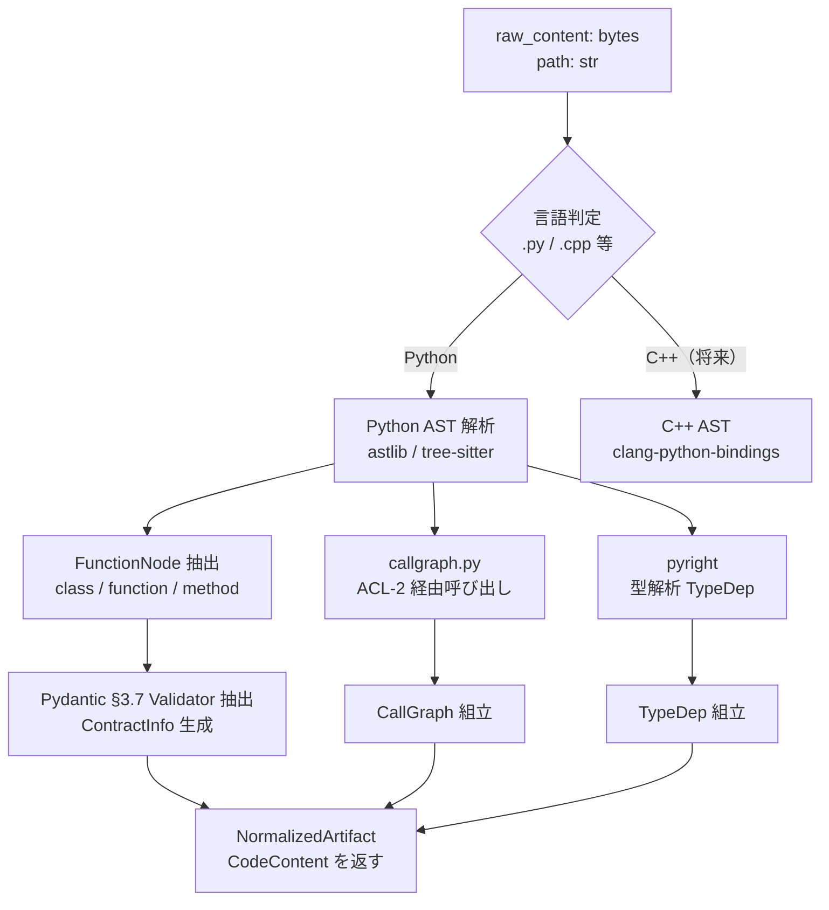

# lib-code-parser — コード AST・call_graph・type_deps 生成（pyright/callgraph.py 連携）

**分類**: Parser
**pip パッケージ名（案）**: spec_reviewer_code_parser
**対応 US**: US-01, US-22, US-25, US-32
**対応 variants**: §4.3 Pattern 3 Contract（§3.7 Pydantic / dataclass validator）

---

## 概要

code_parser はコードファイル（Python を主対象、将来拡張で C++ を視野）を読み込み、AST・コールグラフ・型依存グラフを生成して `CodeContent` へ正規化する Parser lib である。SD-02 の `ParserExecutorPort` 経由で呼び出され、SD-01 の Strategy 群（spec_code_verifier / architecture_verifier）が物理アーキテクチャを参照する際の入力を提供する。

中核の仕事は「コードが何をしているか」を構造として取り出すことである。関数ノードのリスト（`FunctionNode`）・コールグラフ（`CallGraph`）・型依存グラフ（`TypeDep`）の 3 種を抽出する。これらは SD-01 の `ArchitectureStrategy` が spec 由来の論理アーキテクチャ（`SpecContent.embedded_diagrams` から導出）と比較する物理アーキテクチャの実体となる（US-32/US-33 の物理アーキリバース・比較を直接支える）。

コールグラフ生成には `callgraph.py`（ACL-2 経由の決定論的ツール）を、型情報生成には `pyright`（静的型解析）を使用する。どちらも決定論的であり、同一コードに対して常に同一出力を返す。この確定性が Layer M 検証（bisimulation による構造一致判定）を可能にしている。

加えて、Pydantic v2 / dataclass の validator 定義を解析し、クラスに付与された contract（事前条件・不変条件）を `FunctionNode.contracts` として抽出する。これにより spec_code_verifier が DbC スタイルの契約検証（§3.7）を適用できる。

---

## インターフェース

### 入力

`ParserConfig` フィールドとして以下を受け取る（bc-verification-engine.md §6 参照）:

| フィールド | 型 | 内容 |
|---|---|---|
| `artifact_type` | `ArtifactType` | 常に `"code"` |
| `executor_lib` | `str` | `"cicd.parsers.code_parser"` |
| `params.callgraph_tool` | `str` | `"callgraph.py"`（ACL-2 経由で実行するスクリプトパス） |
| `params.type_tool` | `str` | `"pyright"`（static type checker） |
| `params.extract_contracts` | `bool` | Pydantic / dataclass validator から contract を抽出するか（デフォルト: true） |
| `params.language` | `str` | `"python"` \| `"cpp"`（デフォルト: `"python"`） |
| `enabled` | `bool` | このconfig が有効か |

加えて、`ParserExecutorPort.execute()` の呼び出し引数として以下を受け取る:

- `raw_content: bytes` — VCS から取得したコードファイルの生バイト
- `path: str` — VCS 上のファイルパス（`.py` / `.cpp` 等で言語を補助判定）

### 出力

`NormalizedArtifact`（bc-verification-engine.md §6 NormalizedArtifact 定義準拠）:

```
NormalizedArtifact
  artifactId     : ArtifactId
  artifactType   : "code"
  content        : CodeContent
    functions   : List[FunctionNode]    — 関数・メソッド・クラスのノード一覧
    call_graph  : CallGraph             — callgraph.py が生成した呼び出し関係グラフ
    type_deps   : List[TypeDep]         — pyright が生成した型依存関係
```

`FunctionNode` の内部フィールド例:

```
FunctionNode
  node_id       : str              — "module.ClassName.method_name" 形式の完全修飾名
  kind          : str              — "function" | "method" | "class"
  params        : List[ParamInfo]  — 引数名・型アノテーション
  return_type   : str | None       — 戻り値型（pyright 解析結果）
  contracts     : ContractInfo     — Pydantic validator / dataclass 制約（§3.7 から抽出）
    preconditions  : List[str]     — @validator / __post_init__ で検出した事前条件
    invariants     : List[str]     — model_validator(mode="wrap") 等の不変条件
  docstring     : str | None       — docstring（LLM が意味解釈する際のヒント）
  trace_tags    : List[TraceTag]   — コメント内 Traces: タグ（spec との対応）
  source_range  : SourceRange      — ファイル内の行番号範囲
```

`CallGraph` の内部フィールド例:

```
CallGraph
  nodes : List[str]               — FunctionNode の node_id 一覧
  edges : List[Tuple[str, str]]   — (caller_node_id, callee_node_id) ペア
```

---

## 採用する検証手法・アルゴリズム

### §3.7 Pydantic / dataclass validator（軸5: ○）

Python の `BaseModel`（Pydantic v2）や `@dataclass` に付与された `@field_validator` / `model_validator` / `__post_init__` を AST ベースで解析し、クラスが持つ invariant（不変条件）と precondition（事前条件）を `ContractInfo` として抽出する。CrossHair による symbolic execution 検証のための入力としても利用可能。

**採用理由**: 軸5 ○（実行可能 + コード化可能）。US-01 / US-22 の spec→code 意味一致検証において、spec に書かれたビジネスルール（制約・不変条件）がコードの validator として実装されているかを spec_code_verifier が照合するために必要。Pydantic は Python エコシステムで最も広く使われる contract 表現であり、P1-PY の実際のコードベースに直結する。

### callgraph.py（ACL-2 決定論的ツール — variants catalog 外）

`callgraph.py` は静的コール関係を解析する決定論的ツールであり、variants catalog の分類対象（40 variants）には含まれないが、`architecture_verifier` が bisimulation（§6.3 §5.1 State Machine 参照）を適用するための物理アーキテクチャグラフを提供する。同一コードに対して常に同一グラフを生成するため Layer M 検証の基盤として機能する。

### pyright（ACL-2 決定論的ツール — variants catalog 外）

`pyright` は Microsoft の静的型チェッカーであり、型注釈から `TypeDep` を生成する決定論的ツール。`type_deps` は spec_code_verifier が型システム上の契約整合性を確認する際に使用する。

---

## 依存 lib

```
code_parser（本 lib）
  ↓ NormalizedArtifact (CodeContent) を提供
spec_code_verifier  — spec→code / code→spec 意味一致検証（US-01, US-22）
architecture_verifier — 物理アーキグラフ比較（US-32/US-33。call_graph を使用）
```

code_parser は spec_parser / test_parser と独立している。SD-02 の ParserExecutorPort が並列に呼び出すため、相互依存なし。

callgraph.py / pyright は code_parser の内部で subprocess / API 経由で呼び出すため、上位レイヤー（SD-01 Strategy）からは見えない。

---

## Diagram



---

## 参照ドキュメント

- `cicd/doc/sys/verification/catalogs/variants-catalog.md` §4.3（§3.7 Pydantic / dataclass validator — 概要・特性・OSS 実装）/ §6.3（§5.1 State Machine — bisimulation、architecture_verifier が call_graph を使う際の背景理論）
- `cicd/doc/sys/business-process/bc-verification-engine.md` §6（NormalizedArtifact / ParserConfig / CodeContent 型定義）/ §2（SD-02 責務・ACL-2 ツール連携）/ §9（ParserExecutorPort 定義）/ §3（BC 間依存関係図 — callgraph.py / pyright の ACL-2 ポジション）
- `cicd/doc/sys/user-stories/sys.1-userstory.md` §5.1（US-01/US-22）/ §5.5（US-25/US-32）
- `cicd/doc/sys/lib/lib-index.md` §A（Parser 群一覧）/ §SDD 核心フロー（code_parser の物理アーキ生成ポジション）
